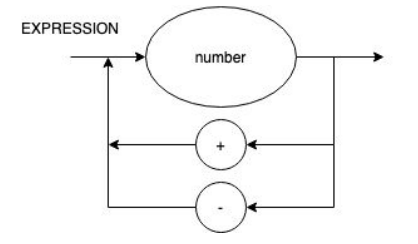
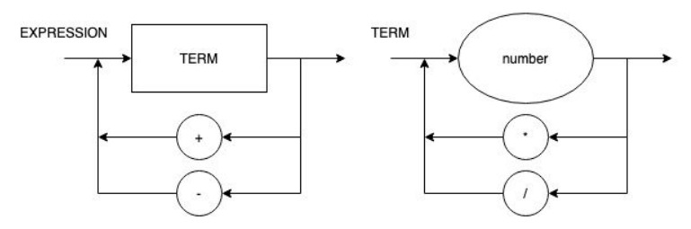
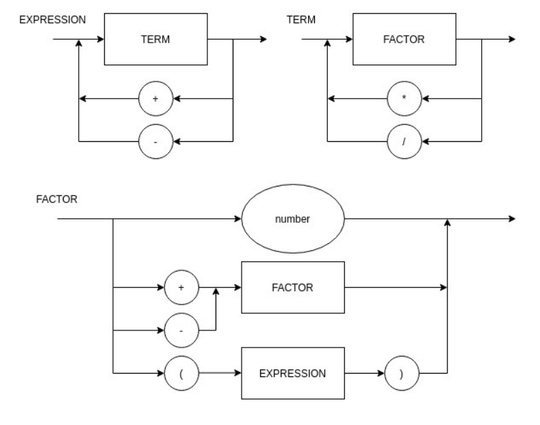
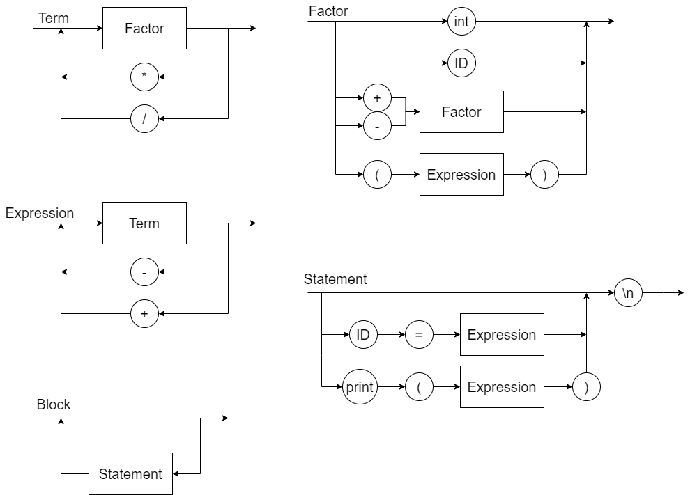

# Sharpiler

## Status dos Testes

# Info

## Dotnet Version -> 7.0.101

## Para rodar o projeto
* Dentro da pasta do projeto, rodar o comando `dotnet run "<ARGS>"`
    * Exemplo: `dotnet run "4+5"`

* Fora da pasta do projeto, rodar o comando `dotnet run --project <PATH_TO_PROJECT> "<ARGS>"`
    * Exemplo: `dotnet run --project "C:\Users\foo\Documents\GitHub\Sharpiler\Sharpiler1" "4+5"`

## Para gerar .exe
* Dentro da pasta do projeto, rodar o comando `dotnet build`
    * O arquivo .exe estará na pasta `bin\Debug\net7.0\Sharpiler1.exe`
    * Para rodar o .exe, rodar o comando `.\bin\Debug\net7.0\Sharpiler1.exe "<ARGS>"`
        * Exemplo: `.\bin\Debug\net7.0\Sharpiler1.exe "4+5"`

# Sobre o projeto

## Roteiro 1

### Diagrama Sintático

### EBNF
EXPRESSION = number, { ("+" | "-"), number } ;  

## Roteiro 2

### Diagrama Sintático

### EBNF 
EXPRESSION = TERM, { ("+" | "-"), TERM } ;  
TERM = number, { ("*" | "/"), number } ;

## Roteiro 3

### Diagrama Sintático

### EBNF 
EXPRESSION = TERM, { ("+" | "-"), TERM } ;  
TERM = FACTOR, { ("*" | "/"), FACTOR } ;  
FACTOR = ("+" | "-") FACTOR | "(" EXPRESSION ")" | number ;

## Roteiro 5

### Diagrama Sintático

### EBNF 
BLOCK = { STATEMENT };  
STATEMENT = ( λ | ASSIGNMENT | PRINT), "\n" ;  
ASSIGNMENT = IDENTIFIER, "=", EXPRESSION ;  
PRINT = "println", "(", EXPRESSION, ")" ;  
EXPRESSION = TERM, { ("+" | "-"), TERM } ;  
TERM = FACTOR, { ("*" | "/"), FACTOR } ;  
FACTOR = (("+" | "-"), FACTOR) | NUMBER | "(", EXPRESSION, ")" | IDENTIFIER ;  
IDENTIFIER = LETTER, { LETTER | DIGIT | "_" } ;  
NUMBER = DIGIT, { DIGIT } ;  
LETTER = ( a | ... | z | A | ... | Z ) ;  
DIGIT = ( 1 | 2 | 3 | 4 | 5 | 6 | 7 | 8 | 9 | 0 ) ;  
